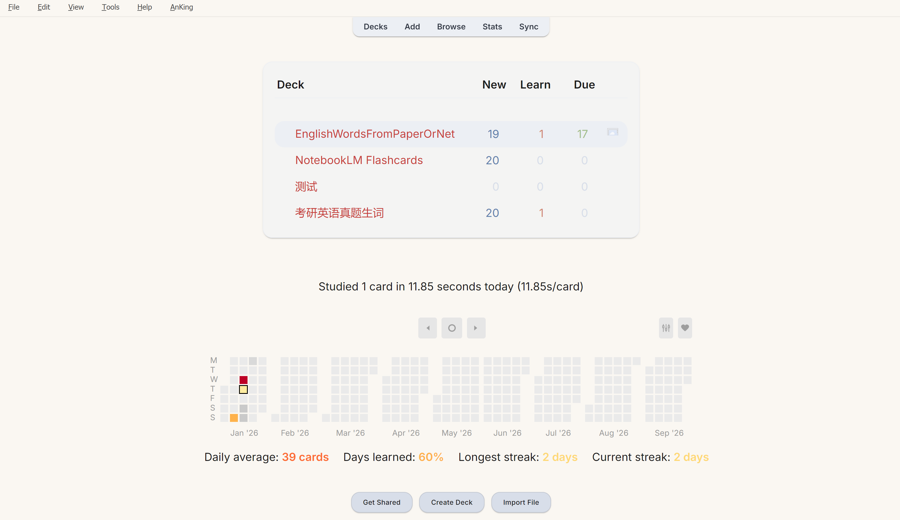
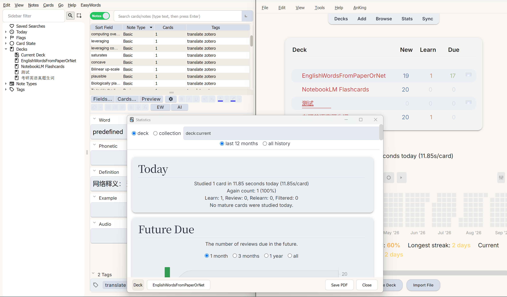
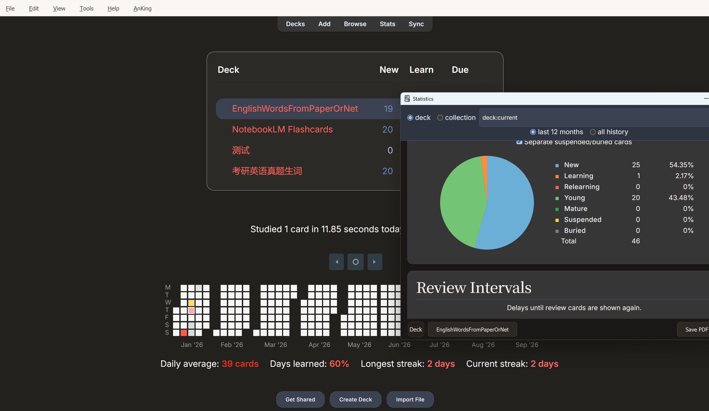
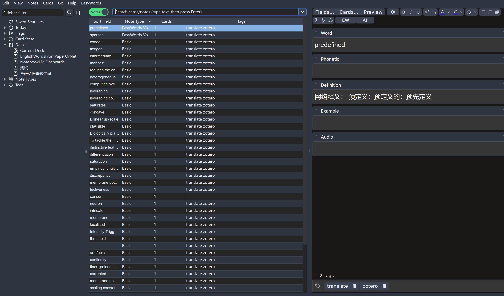

# Anki Beautify Theme

A refined Anki theme inspired by Japanese editorial design. Features warm paper textures, Noto Serif JP typography for headlines, Inter for body text, and traditional vermilion (朱色) accents. Includes carefully crafted light and dark modes.

This is an anki addon for beautify the default anki apperance (both dark and light).

This is suitable for those who enjoys this style and do not want to much configuration (actually this addon didn't even provide a configuration menu for simple)

## Usage

Just simply git clone this repo in your addons folder, then addons will automatically be loaded.

Ankiweb addon code is not provided  considering that this addon doesn't worth uploading to offical addon marcket🤣🤣🤣

> Actually, i upload to github just fot backup, in fear of forgeting the position of some  `"possibly useful"`  plugin  (
>
> Also, all code is untested in  other environments, though it works well on my computer.

## Preview

### Light Mode

### Dark Mode

